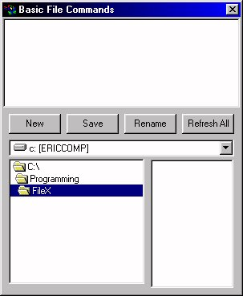



## Save/Load in Binary Text

### Description

Shows the basic save/load procedure in Binary
 
### More Info
 

             |
---                |---
**Submitted On**   |2000-07-24 17:49:02
**By**             |[Eric LeBourgeois](https://github.com/Planet-Source-Code/PSCIndex/blob/master/ByAuthor/eric-lebourgeois.md)
**Level**          |Intermediate
**User Rating**    |5.0 (20 globes from 4 users)
**Compatibility**  |VB 6\.0
**Category**       |[Coding Standards](https://github.com/Planet-Source-Code/PSCIndex/blob/master/ByCategory/coding-standards__1-43.md)
**World**          |[Visual Basic](https://github.com/Planet-Source-Code/PSCIndex/blob/master/ByWorld/visual-basic.md)
**Archive File**   |[CODE\_UPLOAD82327272000\.zip](https://github.com/Planet-Source-Code/eric-lebourgeois-save-load-in-binary-text__1-10117/archive/master.zip)

